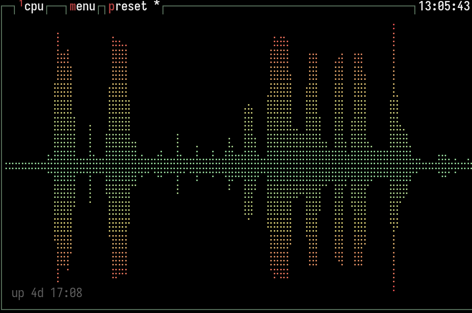
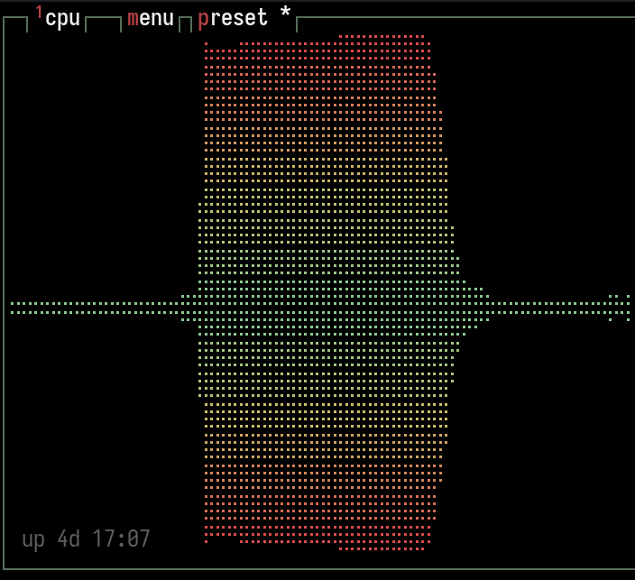
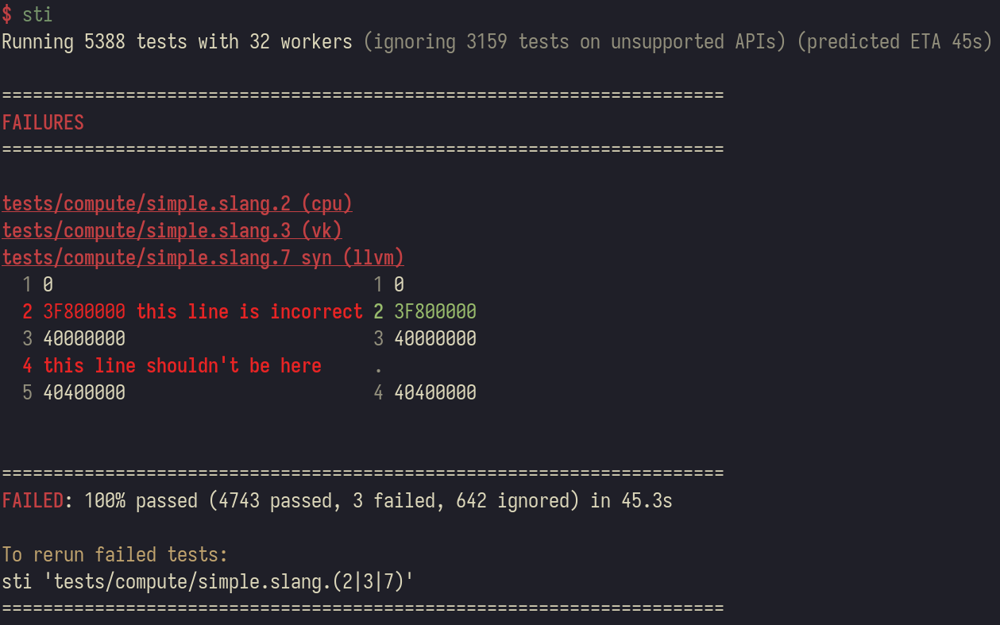
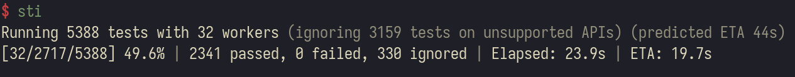

# Slang Test Interceptor

> STI testing could save you a lot of hassle

A wrapper for slang-test which implements several enhancements.

## It's more robust than `slang-test`.

`slang-test -j32` reliably fails before completing the test suite when one of the test servers dies unexpectedly.

`sti` will detect the crash of a worker and reschedule any unaccounted for tests, marking the crashing test as failed.

## It's much faster than `slang-test`.

> (All stats and findings are from my machine, 7950X3D, 96GB, RTX 4090, Linux.)

|                     | `slang-test` | `sti`       |
| ------------------- | ------------ | ----------- |
| `-j24`              | 88s          | 40s         |
| `-j1 tests/compute` | 22.5s        | 15.5s **!** |

This is mainly due to better scheduling and more aggressive management of workers. There are a bunch of tricks:

- Whenever we run a test we record the time it takes, so in future we can avoid having a 'long-pole' test scheduled right at the end.
- `slang-test` also seems to do a lot of single-thread waiting in the middle of runs which we avoid.
- We don't wait for the `slang-test` workers to clean up once they have finished their test, we just kill the process as soon as we see the result of the last test.
- We try to avoid starting 32 GPU jobs at the same time when we begin to avoid lock contention creating contexts.
- We do api detection concurrently with test file detection at the beginning.

| slang-test                                        | sti                                 |
| ------------------------------------------------- | ----------------------------------- |
|  |  |

# More User friendly output

At the end of the run:



- A predicted ETA calculated at the beginning
- Failures with the same actual/expected diff are grouped
- Diffs are shown using an external diff tool
- A command to copy to run just the failed tests

While the tests are running :



- `[running/remaining/total]` - batches running, tests remaining in queue, total tests
- Test counts (passed, failed, ignored)
- Elapsed time and ETA

## Usage

```bash
# Run all tests in the current directory
sti

# Run tests matching a regex filter (infix match)
sti diagnostic

# Run tests matching a prefix
sti '^tests/compute'

# Run multiple filter patterns
sti '^tests/compute' '^tests/autodiff'

# Run internal unit tests
sti slang-unit-test-tool

# List tests that would be run without running them
sti --dry-run diagnostic

# Customize parallelism
sti -j 8

# Ignore tests matching a pattern
sti --ignore 'compute'

# Specific APIs
sti --api vk
sti --ignore-api cuda

# Limit concurrent GPU tests
sti -g 4

# Run only CPU tests
sti -g 0
```

## Options

### Common options

- `<FILTERS>` - Regex patterns to filter tests (union: test runs if it matches ANY filter). Examples: `diagnostic` (infix), `^tests/compute` (prefix), `\.slang$` (suffix). If empty, runs all tests.
- `-C, --root-dir <PATH>` - Root directory of the slang project (default: current directory)
- `-j, --jobs <N>` - Number of parallel workers (default: number of CPUs)
- `-g, --gpu-jobs <N>` - Maximum concurrent GPU batches (vk/cuda/dx11/dx12/metal and gfx-unit-test-tool tests). When set, tests are segmented into GPU-only and CPU-only batches, and at most N GPU batches run concurrently. Use `-g 0` to skip all GPU tests entirely (CPU-only mode).
- `--dry-run` - List tests that would be run without actually running them
- `--ignore <PATTERN>` - Ignore tests matching regex pattern (can be specified multiple times; union: ignored if matches ANY)
- `--api <API>` - Only run tests for specific APIs (can be specified multiple times; union: runs if matches ANY). Examples: `--api vk --api cuda`
- `--ignore-api <API>` - Exclude tests for specific APIs (can be specified multiple times; union: excluded if matches ANY). Examples: `--ignore-api metal`
- `--diff <TOOL>` - Diff tool for expected/actual differences: `none`, `diff`, `git`, `difft`, `auto` (default: `auto`, fallback chain: difft → git → diff → none)
- `--color <MODE>` - Color output mode: `auto`, `always`, `never` (default: `auto`, uses terminal detection)
- `-v, --verbose` - Verbose output: show per-worker progress (which test each worker is running), CPU/GPU load, batch reproduction commands for slow batches, slowest tests report, and batch size histogram
- `-- <ARGS>` - Additional arguments to pass directly to slang-test (e.g., `-- -api vk`)

### Build selection

- `--slang-test <PATH>` - Path to slang-test executable (default: auto-detects newest build)
- `--build-type <TYPE>` - Build type to use: debug, release, relwithdebinfo, or minsizerel (default: newest available)

### Advanced options

- `--retries <N>` - Number of retries for failed tests (default: 2).
- `--batch-size <N>` - Maximum tests per slang-test invocation (default: auto-calculated as `(num_tests/jobs)*2` with timing data, or `min(50, num_tests/jobs)` without)
- `--batch-duration <SECS>` - Target batch duration in seconds when timing data is available (default: auto-calculated as `predicted_runtime/2`, minimum 1.0)
- `--no-timing-cache` - Ignore cached timing data for scheduling and ETA
- `--no-early-api-check` - Disable early API detection (see Early API Detection section below)
- `--event-log <PATH>` - Write CSV event log for performance debugging
- `--timeout <SECS>` - Timeout per test batch in seconds (default: 600 = 10 minutes)
- `--gpu-stagger <MS>` - GPU stagger increment in milliseconds (default: 100). The first N batches (N = jobs) have increasing amounts of CPU work at the start to stagger GPU test launches, reducing Vulkan context creation contention.

When stderr is not a TTY (e.g., in CI or when piped), output automatically switches to machine-readable format: no carriage returns, no terminal clearing, sparse progress updates.

## Crash/Segfault Handling

When slang-test crashes (segfault, timeout, or abnormal exit), the runner uses the following strategy:

### How crashes are detected

1. **Exit code analysis**: Normal completion returns exit code 0 (all pass) or 1 (some failures). Any other exit code (e.g., 139 for segfault) indicates a crash.

2. **Timeout detection**: If a batch exceeds the timeout (default 10 minutes, configurable via `--timeout`), the process is killed and the test is marked as failed.

### How the crashing test is identified

Since slang-test only prints test results _after_ a test completes, a crash means the crashing test's name was never printed. The runner identifies it by:

1. **Tracking completed tests**: All test names that were printed before the crash are collected.
2. **Computing remaining tests**: The runner compares the list of test files sent to the batch against the tests that completed. Any test file not accounted for in the output is considered "remaining".

### Recovery process

1. **Process completed results**: Tests that passed/failed/ignored before the crash are counted normally.

2. **Identify the culprit**: The first test that didn't complete is identified and marked as failed with "Test caused slang-test to crash".

3. **Repool remaining tests**: Tests that were in the batch after the crashed test are put back into the work pool for other workers to pick up.

4. **Continue execution**: Other batches and workers continue running unaffected.

### Example scenario

Batch contains: `[test-a.slang, test-b.slang, test-c.slang, test-d.slang]`

slang-test output before crash:

```
passed test: 'test-a.slang (cpu)'
ignored test: 'test-b.slang (cuda)'
```

Then segfault occurs.

Recovery:

1. `test-a` counted as passed, `test-b` counted as ignored
2. `test-c.slang` marked as failed (crash) - it was the first test without output
3. `test-d.slang` repooled for another worker to run

## Retry Logic

Failed tests are automatically retried to handle transient failures:

1. **When retries happen**: Failed tests are immediately re-queued for retry concurrently with other running batches. Retries don't wait for the full run to complete.
2. **Retry tracking**: Each test name is tracked to prevent infinite retry loops.
3. **Success on retry**: If the specific test passes on retry, it's counted as passed and noted in the summary.
4. **Persistent failure**: If retry also fails, the test is marked failed with full failure output.

Note: Retries only work for file-based tests where the test file exists on disk. Internal tests (`.internal`) are not retried.

## slang-test output formats

The runner parses the following output patterns from slang-test:

```
passed test: 'tests/compute/array-param.slang.1 (cpu)'
passed test: 'tests/autodiff/compileBenchmark.internal' 7.51838s
FAILED test: 'tests/compute/foo.slang (vk)'
ignored test: 'tests/compute/bar.slang (cuda)'
```

Test names have the format:

- `<test-file>.<variant> (<backend>)` - e.g., `tests/compute/array-param.slang.1 (cpu)`
- `<test-file>.<variant> syn (<backend>)` - synthesized tests, e.g., `tests/compute/array-param.slang.5 syn (llvm)`
- `<category>/<test-name>.internal` - internal unit tests, e.g., `slang-unit-test-tool/modulePtr.internal`

Failure details are printed on lines starting with `[test-name]` **before** the `FAILED test:` line:

```
[slang-unit-test-tool/RecordReplay_cpu_hello_world.internal] Failed to launch process of 'cpu-hello-world'
FAILED test: 'slang-unit-test-tool/RecordReplay_cpu_hello_world.internal'
```

Exit codes:

- `0` - All tests passed (or only ignored)
- `1` - Some tests failed

## Early API Detection

Before discovering tests, the runner performs a quick check to determine which graphics APIs are supported on the current system. This allows tests for unsupported APIs to be filtered out early, improving scheduling accuracy and reducing unnecessary work.

### How it works

1. **Quick probe**: At startup, runs `slang-test tests/compute/simple.slang -api cpu` which outputs "Check" lines indicating API support status
2. **Parse results**: Lines like `Check vk,vulkan: Supported` and `Check dx12,d3d12: Not Supported` are parsed to build a list of unsupported APIs
3. **Early filtering**: During test discovery, tests for unsupported APIs are filtered out and counted separately
4. **Optimized batch runs**: When the API check succeeds, `-skip-api-detection` is passed to batch slang-test invocations since we already know which APIs are available

## Ctrl-C Handling

Pressing Ctrl-C gracefully interrupts the test run:

1. All running batches are signaled to stop
2. Current progress is preserved
3. A summary is printed with all results collected so far
4. The runner exits with a non-zero status

## Dynamic Work Pool

Instead of pre-creating batches, the runner uses a dynamic work pool that workers pull from:

1. **Duration-based batching**: When timing data is available, batches target a duration (via `--batch-duration`, auto-calculated by default) rather than a fixed file count. This balances startup overhead against batch size. Without timing data, random batches up to `--batch-size` are used.

2. **Constrained random shuffle**: Tests are randomly placed, but each test is constrained so it can't become the "long pole" at the end. For a test predicted to take X seconds with total run time Y, it's placed randomly in the first `(Y-X)/Y` fraction of the schedule. This prevents slow tests from clustering at the end while maintaining randomness to avoid GPU contention.

3. **Retry integration**: Failed tests go back into the same pool, automatically getting picked up by available workers.

4. **Progress display**: Shows `[running/remaining/total]` so you can see parallelism level:
   - `[32/100/3000]` = 32 batches running, 100 tests remaining in queue, 3000 total tests
   - `[8/0/3000]` = 8 batches running, queue empty (finishing up)

## Timing-Based Scheduling

The runner maintains a cache of test execution times to optimize scheduling:

### How it works

1. **Per-test timing**: During execution, the runner tracks how long each test variant takes (e.g., `tests/foo.slang.0`, `tests/foo.slang.1`)

2. **Build-type segmentation**: Timing data is stored separately for debug, release, and relwithdebinfo builds. This ensures accurate predictions since debug builds are significantly slower than release builds.

3. **Cache storage**: After each run, timing data is saved to the state directory (see below)

4. **Constrained random scheduling**: On subsequent runs, tests are randomly shuffled but constrained so slow tests can't end up at the very end. This prevents the "long tail" problem while maintaining randomness to avoid GPU contention from clustering similar tests together.

### State location

- Linux: `~/.local/state/slang-test-interceptor/timing.json`
- macOS: `~/Library/Application Support/slang-test-interceptor/timing.json`
- Windows: `%LOCALAPPDATA%\slang-test-interceptor\timing.json`

The state is automatically created and updated. Delete it to reset timing estimates.

## How it works

Test discovery uses `slang-test -dry-run` to enumerate all available tests (both file-based and internal tests). This ensures the runner knows exactly which tests exist without needing to scan the filesystem.

`slang-test` can be run over specific test cases in a single threaded mode like `slang-test tests/foo/bar.slang tests/baz/qux.slang`

There is some overhead in starting `slang-test` so we don't just want to spin up slang-test for every test, we want to run N batches of tests at once where N is the degree of parallelism we want, but not have batches so large that we might be waiting for the slow one at the end of the run.

There might be several tests per test file, some of which are synthesized and some are ignored.

There are also internal tests not represented by files, these are called `slang-unit-test-tool/modulePtr.internal` or similar.

At the end it will output a command which will run all the non-passing and non-ignored tests.

## Building

```bash
cargo build --release
```

The binary will be at `target/release/sti`.
